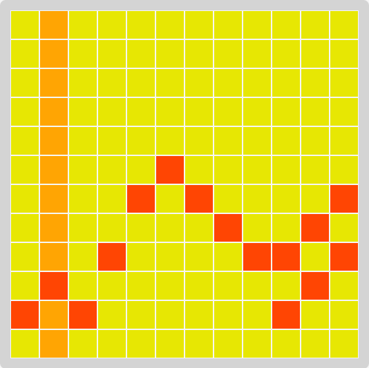

===============================
Gridic
===============================

.. image:: https://badge.fury.io/py/gridic.png
    :target: http://badge.fury.io/py/gridic

A note/time grid that helps create small fragments of music.

How to Install
--------------

* Download and install Fluidsynth from http://www.fluidsynth.org/
* Download a soundfont from `HammerSound <http://www.hammersound.com/cgi-bin/soundlink.pl?action=view_category&category=Piano&ListStart=0&ListLength=15>`_
* Use pip to install Gridic

::

    pip install gridic

* Open your python interpreter and run gridic

::

    >>> import gridic
    >>> gridic.run(SOUNDFONT_FILE=YOUR_SOUNDFONT_LOCATION)

* Alternately, download this package from Github/PyPI and use `python setup.py install`

* Soundfonts, midi mappings and delay is configurable
* Free software: BSD license
* Documentation: https://gridic.readthedocs.org.